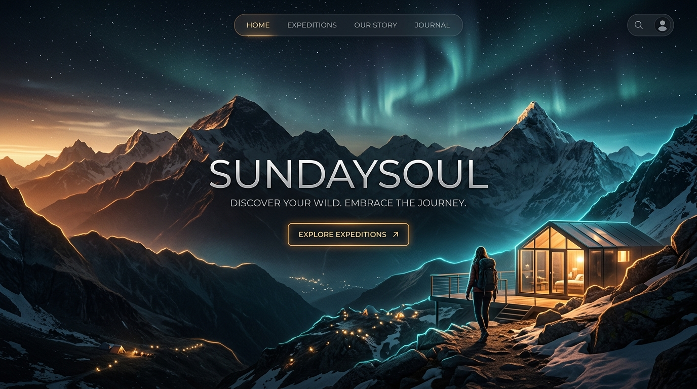
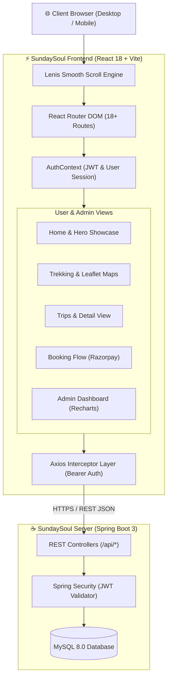

<div align="center">

  <!-- Aesthetic Panoramic Hero Showcase Banner -->
  <a href="https://github.com/bangalsubham20/SundaySoul">
    
  </a>

  <br /><br />

  <!-- Animated Interactive Feature & Status HUD -->
  

  <br />

  <!-- Dynamic Shields Badges -->
  <p align="center">
    <a href="https://react.dev/"></a>
    <a href="https://vitejs.dev/"></a>
    <a href="https://tailwindcss.com/"></a>
    <a href="https://www.framer.com/motion/"></a>
    <a href="https://leafletjs.com/"></a>
    <a href="https://docker.com/"></a>
  </p>

  <p align="center">
    
    
    
    
  </p>

  <!-- Quick Navigation Pills -->
  <p align="center">
    <a href="#-key-highlights"><b>🌟 Highlights</b></a> •
    <a href="#-visual-showcase"><b>📸 Showcase</b></a> •
    <a href="#-feature-ecosystem"><b>⚡ Features</b></a> •
    <a href="#-tech-stack-matrix"><b>🛠️ Tech Stack</b></a> •
    <a href="#-system-architecture"><b>🏛️ Architecture</b></a> •
    <a href="#-quick-start"><b>🚀 Getting Started</b></a> •
    <a href="#-environment-variables"><b>⚙️ Config</b></a> •
    <a href="#-docker-deployment"><b>🐳 Docker</b></a>
  </p>

</div>

---

## 📖 Overview

**SundaySoul** is a premier, hyper-modern travel and high-altitude trekking platform designed for modern explorers. Engineered with an uncompromising focus on aesthetic excellence, micro-interactions, and real-time responsiveness, SundaySoul bridges the gap between adrenaline-fueled expeditions and high-touch digital booking experiences.

Built on **React 18**, **Vite**, and **Tailwind CSS**, enhanced with **Framer Motion spring physics** and **Lenis smooth momentum scrolling**, SundaySoul delivers an organic 60 FPS viewport journey from the first mountain pass to final checkout.

---

## 🌟 Key Highlights

<table>
  <tr>
    <td width="50%" valign="top">
      <h3>🎨 Visual Symphony & Glassmorphism</h3>
      <ul>
        <li><b>Luminous Glass Panels:</b> <code>backdrop-blur-xl</code> translucent cards with glowing gradient borders and ambient depth.</li>
        <li><b>Tailored Typography:</b> Curated font pairings with <b>Outfit</b> for bold headlines, <b>Inter</b> for high legibility, and <b>JetBrains Mono</b> for elevation & GPS metrics.</li>
        <li><b>S-Curve Hero Masking:</b> Fluid organic SVG curvature framing mountain panoramas.</li>
      </ul>
    </td>
    <td width="50%" valign="top">
      <h3>⚡ High Performance Engineering</h3>
      <ul>
        <li><b>Lenis 60fps Smooth Scroll:</b> Inertial smooth momentum navigation across all landing sections.</li>
        <li><b>Route-Level Code Splitting:</b> Lazy-loaded pages with custom animated loading fallbacks for sub-second page transitions.</li>
        <li><b>Robust State & Auth:</b> Secure JWT lifecycle orchestration with persistent sessions and role-gated routes.</li>
      </ul>
    </td>
  </tr>
  <tr>
    <td width="50%" valign="top">
      <h3>🗺️ Geographic & Trekking Intelligence</h3>
      <ul>
        <li><b>Interactive Leaflet Geospatial Maps:</b> Real-time trail coordinates, campsite waypoints, and topographical visualizer.</li>
        <li><b>Expedition Metrics:</b> Instant altitude graphs, difficulty ratings, oxygen levels, and weather cues.</li>
      </ul>
    </td>
    <td width="50%" valign="top">
      <h3>📊 Command & Admin Analytics</h3>
      <ul>
        <li><b>Live Metrics Dashboard:</b> Visualized booking trajectories, active user charts, and gross volume via <b>Recharts</b>.</li>
        <li><b>Expedition CMS:</b> Create, update, toggle availability, and audit bookings directly with granular admin roles.</li>
      </ul>
    </td>
  </tr>
</table>

---

## 📸 Visual Showcase

<div align="center">
  <table>
    <tr>
      <td width="50%" align="center">
        
        <br />
        <sub><b>🏔️ Panoramic High-Altitude Trekking Discovery</b></sub>
      </td>
      <td width="50%" align="center">
        
        <br />
        <sub><b>🌊 Island & Coastal Retreats Gateway</b></sub>
      </td>
    </tr>
    <tr>
      <td width="50%" align="center">
        
        <br />
        <sub><b>⛺ Basecamp Stays & Night Sky Trails</b></sub>
      </td>
      <td width="50%" align="center">
        
        <br />
        <sub><b>❄️ Extreme Pass Crossings & Glacier Routes</b></sub>
      </td>
    </tr>
  </table>
</div>

---

## ⚡ Feature Ecosystem

```
                                      SUNDAYSOUL PLATFORM
                                               │
         ┌─────────────────────────┬───────────┴───────────┬─────────────────────────┐
         ▼                         ▼                       ▼                         ▼
   🌍 Public Portal          🏔️ Trekking Hub        🔐 Explorer Space         🛡️ Admin Control
   • Hero Discovery          • Interactive Maps      • Auth & JWT Session      • Recharts Analytics
   • Multi-Param Search      • Elevation Charts      • Expedition Booking      • Trip Management
   • Trending Trips          • Itinerary Timelines   • Payment Gateway         • Booking Auditing
   • Traveler Stories        • Gear Checklists       • Profile & Passes        • User Registry
```

### 1. 🔍 Multi-Parameter Intelligent Search
- Seamless query formulation filtering by **Destination**, **Departure Window**, and **Traveler Capacity**.
- Floating glassmorphic popover calendar and traveler counter with zero screen clutter.

### 2. 🗺️ Interactive Route & Waypoint Visualizer
- Powered by `react-leaflet` with custom mountain SVG map markers.
- Interactive trail waypoints showing altitude checkpoints, shelter locations, and water sources.

### 3. 💳 Multi-Step Checkout & Booking Engine
- Comprehensive booking wizard: Explorer details, emergency contact validation, date selection, and add-on rentals.
- Seamless transaction lifecycle ready for **Razorpay** integration with dynamic cost calculations and booking receipt badges.

### 4. 📈 Executive Admin Control Room
- Complete administrative management suite gated behind JWT role verification (`admin`).
- Interactive trend graphs via `recharts` for monthly booking spikes, category distribution, and revenue.

---

## 🛠️ Tech Stack Matrix

| Layer | Technology | Version | Purpose |
| :--- | :--- | :--- | :--- |
| **Core Framework** | [React](https://react.dev/) | `v18.2.0` | Declarative component UI model with concurrent mode |
| **Bundler & Tooling** | [Vite](https://vitejs.dev/) | `v4.5.x` | Lightning-fast HMR and optimized Rollup production builds |
| **Styling & Design** | [Tailwind CSS](https://tailwindcss.com/) | `v3.3.0` | Utility-first styling with custom glassmorphism plugins |
| **Animation Physics** | [Framer Motion](https://www.framer.com/motion/) | `v12.x` | Spring-physics transitions, scroll triggers, and enter/exit morphing |
| **Smooth Scrolling** | [Lenis](https://lenis.darkroom.engineering/) | `v1.3.x` | Inertial smooth 60fps momentum scroll experience |
| **Mapping & GIS** | [Leaflet](https://leafletjs.com/) + [React Leaflet](https://react-leaflet.js.org/) | `v1.9.4` | Interactive vector maps and trail pin markers |
| **Data Visualization**| [Recharts](https://recharts.org/) | `v3.7.0` | Composable charting library for admin revenue and analytics |
| **Notifications** | [React Hot Toast](https://react-hot-toast.com/) | `v2.6.0` | Ultra-clean toast micro-notifications |
| **HTTP Client** | [Axios](https://axios-http.com/) | `v1.5.0` | Promise-based REST client with auth token interceptors |
| **Icons Suite** | [React Icons](https://react-icons.github.io/react-icons/) | `v4.11.0` | Feather, FontAwesome, and Heroicon vector iconography |
| **Container Engine** | [Docker](https://www.docker.com/) + [Nginx](https://nginx.org/) | Multi-Stage | Alpine-based optimized production containerization |

---

## 🏛️ System Architecture



---

## 📂 Page Directory & Navigation Map

<details>
<summary><b>👉 Click to expand full Application Routing Directory (18+ Views)</b></summary>

<br />

| Route Path | View Component | Access Tier | Description |
| :--- | :--- | :--- | :--- |
| `/` | `Home.jsx` | Public | Main portal, S-curve hero, trending trips, traveler reviews |
| `/trekking` | `Trekking.jsx` | Public | High-altitude showcase, interactive maps, trail difficulty stats |
| `/trips` | `Trips.jsx` | Public | Searchable, filterable expedition catalog with category filters |
| `/trips/:id` | `TripDetail.jsx` | Public | Deep dive into trip itineraries, gear guide, inclusions, pricing |
| `/about` | `About.jsx` | Public | Company mission, founding story, safety guidelines, team |
| `/contact` | `Contact.jsx` | Public | Inquiry submission, expedition booking support form |
| `/community` | `Community.jsx` | Public | Explorer forums, trip photo highlights, community stories |
| `/faq` | `FAQ.jsx` | Public | Expandable accordion answering travel, gear, and booking queries |
| `/terms` & `/privacy` | Legal Views | Public | Service agreements, refund policies, and privacy disclosures |
| `/login` & `/register` | Auth Views | Public | JWT-secured customer registration and authentication |
| `/profile` | `Profile.jsx` | **Protected (User)** | Active reservations, pass download, profile customization |
| `/booking/:tripId` | `Booking.jsx` | **Protected (User)** | Multi-step booking configuration, traveler info, checkout |
| `/booking-confirmation/:tripId` | Confirmation | **Protected (User)** | Digital boarding pass, receipt ID, itinerary download |
| `/admin/login` | `AdminLogin.jsx` | Public / Admin | Dedicated privileged portal for management personnel |
| `/admin/dashboard` | `AdminDashboard.jsx`| **Protected (Admin)** | Analytics charts, trip creation/editing, booking management |
| `*` | `NotFound.jsx` | Public | Fluid 404 error page with quick rerouting |

</details>

---

## 🚀 Quick Start

### 1. Prerequisites
Ensure your local development environment has:
- **Node.js** `v18.0.0` or higher ([Download Node.js](https://nodejs.org/))
- **npm** `v9.0.0` or higher (or `pnpm` / `yarn`)
- **Backend Service**: [SundaySoul-Server](https://github.com/bangalsubham20/SundaySoul-Server) running locally or hosted on Render.

### 2. Clone & Setup

```bash
# 1. Clone the repository
git clone https://github.com/bangalsubham20/SundaySoul.git
cd SundaySoul

# 2. Install production and development dependencies
npm install

# 3. Configure environment settings
cp .env.example .env   # Or create .env as shown below
```

### 3. Launch Development Server

```bash
npm run dev
```

The Vite dev server will spin up instantly:
```text
  VITE v4.5.0  ready in 240 ms

  ➜  Local:   http://localhost:5173/
  ➜  Network: use --host to expose
```

### 4. Build for Production

```bash
# Validate and build optimized assets
npm run build

# Preview production build locally
npm run preview
```

---

## ⚙️ Environment Variables

Create a `.env` file in the root of the project to customize your integration endpoints:

```env
# URL pointing to the Spring Boot REST API
VITE_API_URL=https://sundaysoul-server.onrender.com/api

# Razorpay Test / Production Key ID
VITE_RAZORPAY_KEY=rzp_test_your_razorpay_key_here

# Brand / Platform Display Name
VITE_APP_NAME=SundaySoul
```

| Variable | Type | Default | Description |
| :--- | :--- | :--- | :--- |
| `VITE_API_URL` | String | `http://localhost:8080/api` | REST API backend endpoint |
| `VITE_RAZORPAY_KEY` | String | `rzp_test_...` | Razorpay public key for checkout modal |
| `VITE_APP_NAME` | String | `SundaySoul` | Global application title name |

---

## 🐳 Docker Deployment

The application features a production-ready, multi-stage Docker build utilizing **Node 18 Alpine** for bundling and **Nginx Alpine** for ultra-lightweight static file delivery with HTTP gzip compression and SPA routing.

```bash
# Build the production Docker image
docker build -t sundaysoul-frontend:latest .

# Run the container mapping port 80
docker run -d \
  --name sundaysoul-web \
  -p 80:80 \
  --restart unless-stopped \
  sundaysoul-frontend:latest
```

Access the containerized instance at `http://localhost`.

---

## 🤝 Contributing & Community

Contributions are what make the open-source community an inspiring place to learn, create, and explore!

1. Fork the Project
2. Create your Feature Branch (`git checkout -b feature/AmazingExpeditionFeature`)
3. Commit your Changes (`git commit -m 'feat: Add 3D mountain elevation viewer'`)
4. Push to the Branch (`git push origin feature/AmazingExpeditionFeature`)
5. Open a Pull Request

---

## 📄 License

Distributed under the **MIT License**. See [`LICENSE`](LICENSE) for more information.

---

<div align="center">
  <br />
  
  
  <p>
    <b>Crafted with ❤️ and adrenaline for explorers worldwide</b>
  </p>
  
  <p>
    Developed by <b><a href="https://github.com/bangalsubham20">Subham Bangal</a></b> • 🇮🇳 Kolkata, India
  </p>
  
  <p>
    <a href="https://github.com/bangalsubham20/SundaySoul/stargazers">⭐ Star us on GitHub</a> •
    <a href="https://github.com/bangalsubham20/SundaySoul/issues">🐛 Report Bug</a> •
    <a href="https://github.com/bangalsubham20/SundaySoul/issues">💡 Request Feature</a>
  </p>
</div>
